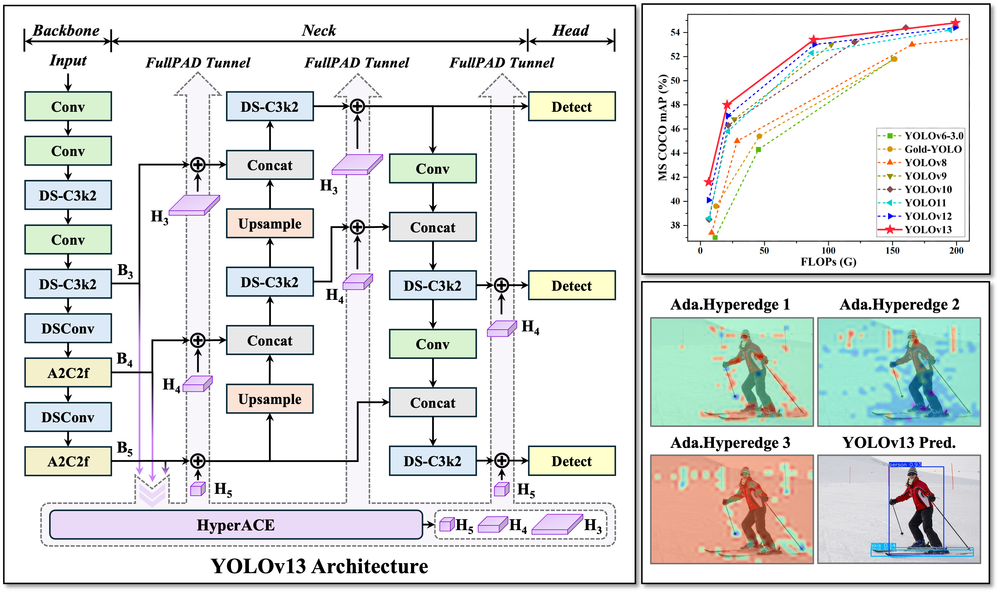

<p align="center">
    
<p>
<h2 align="center">YOLOv13: Real-Time Object Detection with Hypergraph-Enhanced Adaptive Visual Perception</h2>

<p align="center">
    <a href="https://arxiv.org/abs/2506.17733">
    
  </a>
  <a href="https://github.com/iMoonLab">
    
  </a>
</p>

  
<div align="center">
    
</div>

## Updates

- 2025/06/27: [Converting YOLOv13](https://github.com/kaylorchen/ai_framework_demo) to Huawei Ascend (OM), Rockchip (RKNN) formats is supported. Thanks to [kaylorchen](https://github.com/kaylorchen)!

- 2025/06/25: [FastAPI REST API](https://github.com/iMoonLab/yolov13/tree/main/examples/YOLOv13-FastAPI-REST-API) is supported. Thanks to [MohibShaikh](https://github.com/MohibShaikh)!

- 2025/06/24: 🔥 **The paper of YOLOv13 can be downloaded**: [🔗 YOLOv13: Real-Time Object Detection with Hypergraph-Enhanced Adaptive Visual Perception](https://arxiv.org/abs/2506.17733).

- 2025/06/24: [Android deployment](https://github.com/mpj1234/ncnn-yolov13-android/tree/main) is supported. Thanks to [mpj1234](https://github.com/mpj1234)!

- 2025/06/22: YOLOv13 model weights released.

- 2025/06/21: The code of YOLOv13 has been open-sourced.


<h2>Table of Contents</h2>

- [Technical Briefing 💡](#technical-briefing-)
- [Main Results 🏆](#main-results-)
  - [1. MS COCO Benchmark](#1-ms-coco-benchmark)
  - [2. Visualizations](#2-visualizations)
- [Quick Start 🚀](#quick-start-)
  - [1. Install Dependencies](#1-install-dependencies)
  - [2. Validation](#2-validation)
  - [3. Training](#3-training)
  - [4. Prediction](#4-prediction)
  - [5. Export](#5-export)
- [Related Projects 🔗](#related-projects-)
- [Cite YOLOv13 📝](#cite-yolov13-)


## Technical Briefing 💡


**Introducing YOLOv13**—the next-generation real-time detector with cutting-edge performance and efficiency. YOLOv13 family includes four variants: Nano, Small, Large, and X-Large, powered by:

* **HyperACE: Hypergraph-based Adaptive Correlation Enhancement**

  * Treats pixels in multi-scale feature maps as hypergraph vertices.
  * Adopts a learnable hyperedge construction module to adaptively exploring high-order correlations between vertices.
  * A message passing module with linear complexity is leveraged to effectively aggregate multi-scale features with the guidance of high-order correlations to achieve effective visual perception of complex scenarios.

* **FullPAD: Full-Pipeline Aggregation-and-Distribution Paradigm**

  * Uses the HyperACE to aggregate multi-scale features of the backbone and extract high-order correlations in the hypergraph space.
  * FullPAD paradigm further leverages three separate tunnels to forward these correlation-enhanced features to the connection between the backbone and neck, the internal layers of the neck, and the connection between the neck and head, respectively. In this way, YOLOv13 achieves fine‑grained information flow and representational synergy across the entire pipeline.
  * FullPAD significantly improves gradient propagation and enhances the detection performance.

* **Model Lightweighting via DS-based Blocks**

  * Replaces large-kernel convolutions with blocks building based on depthwise separable convolutions (DSConv, DS-Bottleneck, DS-C3k, DS-C3k2), preserving receptive field while greatly reducing parameters and computation.
  * Achieves faster inference speed without sacrificing accuracy.

> YOLOv13 seamlessly combines hypergraph computation with end-to-end information collaboration to deliver a more accurate, robust, and efficient real-time detection solution.


## Main Results 🏆

### 1. MS COCO Benchmark

**Table 1. Quantitative comparison with other state-of-the-art real-time object detectors on the MS COCO dataset**


| **Method** | **FLOPs (G)** | **Parameters(M)** | **AP<sub>50:95</sub><sup>val</sup>** | **AP<sub>50</sub><sup>val</sup>** | **AP<sub>75</sub><sup>val</sup>** | **Latency (ms)** |
| :--- | :---: | :---: | :---: | :---: | :---: | :---: |
| YOLOv6-3.0-N | 11.4 | 4.7 | 37.0 | 52.7 | – | 2.74 |
| Gold-YOLO-N | 12.1 | 5.6 | 39.6 | 55.7 | – | 2.97 |
| YOLOv8-N | 8.7 | 3.2 | 37.4 | 52.6 | 40.5 | 1.77 |
| YOLOv10-N | 6.7 | 2.3 | 38.5 | 53.8 | 41.7 | 1.84 |
| YOLO11-N | 6.5 | 2.6 | 38.6 | 54.2 | 41.6 | 1.53 |
| YOLOv12-N | 6.5 | 2.6 | 40.1 | 56.0 | 43.4 | 1.83 |
| **YOLOv13-N** | **6.4** | **2.5** | **41.6** | **57.8** | **45.1** | **1.97** |
|           |           |            |                 |           | 
| YOLOv6-3.0-S | 45.3 | 18.5 | 44.3 | 61.2 | – | 3.42 |
| Gold-YOLO-S | 46.0 | 21.5 | 45.4 | 62.5 | – | 3.82 |
| YOLOv8-S | 28.6 | 11.2 | 45.0 | 61.8 | 48.7 | 2.33 |
| RT-DETR-R18 | 60.0 | 20.0 | 46.5 | 63.8 | – | 4.58 |
| RT-DETRv2-R18 | 60.0 | 20.0 | 47.9 | 64.9 | – | 4.58 |
| YOLOv9-S | 26.4 | 7.1 | 46.8 | 63.4 | 50.7 | 3.44 |
| YOLOv10-S | 21.6 | 7.2 | 46.3 | 63.0 | 50.4 | 2.53 |
| YOLO11-S | 21.5 | 9.4 | 45.8 | 62.6 | 49.8 | 2.56 |
| YOLOv12-S | 21.4 | 9.3 | 47.1 | 64.2 | 51.0 | 2.82 |
| **YOLOv13-S** | **20.8** | **9.0** | **48.0** | **65.2** | **52.0** | **2.98** |
|           |           |            |                 |           | 
| YOLOv6-3.0-L | 150.7 | 59.6 | 51.8 | 69.2 | – | 9.01 |
| Gold-YOLO-L | 151.7 | 75.1 | 51.8 | 68.9 | – | 10.69 |
| YOLOv8-L | 165.2 | 43.7 | 53.0 | 69.8 | 57.7 | 8.13 |
| RT-DETR-R50 | 136.0 | 42.0 | 53.1 | 71.3 | – | 6.93 |
| RT-DETRv2-R50 | 136.0 | 42.0 | 53.4 | 71.6 | – | 6.93 |
| YOLOv9-C | 102.1 | 25.3 | 53.0 | 70.2 | 57.8 | 6.64 |
| YOLOv10-L | 120.3 | 24.4 | 53.2 | 70.1 | 57.2 | 7.31 |
| YOLO11-L | 86.9 | 25.3 | 52.3 | 69.2 | 55.7 | 6.23 |
| YOLOv12-L | 88.9 | 26.4 | 53.0 | 70.0 | 57.9 | 7.10 |
| **YOLOv13-L** | **88.4** | **27.6** | **53.4** | **70.9** | **58.1** | **8.63** |
|           |           |            |                 |           | 
| YOLOv8-X | 257.8 | 68.2 | 54.0 | 71.0 | 58.8 | 12.83 |
| RT-DETR-R101 | 259.0 | 76.0 | 54.3 | 72.7 | – | 13.51 |
| RT-DETRv2-R101| 259.0 | 76.0 | 54.3 | 72.8 | – | 13.51 |
| YOLOv10-X | 160.4 | 29.5 | 54.4 | 71.3 | 59.3 | 10.70 |
| YOLO11-X | 194.9 | 56.9 | 54.2 | 71.0 | 59.1 | 11.35 |
| YOLOv12-X | 199.0 | 59.1 | 54.4 | 71.1 | 59.3 | 12.46 |
| **YOLOv13-X** | **199.2** | **64.0** | **54.8** | **72.0** | **59.8** | **14.67** |


### 2. Visualizations

<div>
    
</div>

**Visualization examples of YOLOv10-N/S, YOLO11-N/S, YOLOv12-N/S, and YOLOv13-N/S.**

<div>
    
</div>

**Representative visualization examples of adaptive hyperedges. The hyperedges in the first and second columns mainly focus on the high-order interactions among objects in the foreground. The third column mainly focuses on the high-order interactions between the background and part of the foreground. The visualization of these hyperedges can intuitively reflect the high-order visual associations modeled by the YOLOv13.**


## Quick Start 🚀

### 1. Install Dependencies

```
wget https://github.com/Dao-AILab/flash-attention/releases/download/v2.7.3/flash_attn-2.7.3+cu11torch2.2cxx11abiFALSE-cp311-cp311-linux_x86_64.whl
conda create -n yolov13 python=3.11
conda activate yolov13
pip install -r requirements.txt
pip install -e .
```
YOLOv13 suppports Flash Attention acceleration.

### 2. Validation
[`YOLOv13-N`](https://github.com/iMoonLab/yolov13/releases/download/yolov13/yolov13n.pt)
[`YOLOv13-S`](https://github.com/iMoonLab/yolov13/releases/download/yolov13/yolov13s.pt)
[`YOLOv13-L`](https://github.com/iMoonLab/yolov13/releases/download/yolov13/yolov13l.pt)
[`YOLOv13-X`](https://github.com/iMoonLab/yolov13/releases/download/yolov13/yolov13x.pt)

Use the following code to validate the YOLOv13 models on the COCO dataset. Make sure to replace `{n/s/l/x}` with the desired model scale (nano, small, plus, or ultra).
```python
from ultralytics import YOLO

model = YOLO('yolov13{n/s/l/x}.pt')  # Replace with the desired model scale
```

### 3. Training

Use the following code to train the YOLOv13 models. Make sure to replace `yolov13n.yaml` with the desired model configuration file path, and `coco.yaml` with your coco dataset configuration file.
```python
from ultralytics import YOLO

model = YOLO('yolov13n.yaml')

# Train the model
results = model.train(
  data='coco.yaml',
  epochs=600, 
  batch=256, 
  imgsz=640,
  scale=0.5,  # S:0.9; L:0.9; X:0.9
  mosaic=1.0,
  mixup=0.0,  # S:0.05; L:0.15; X:0.2
  copy_paste=0.1,  # S:0.15; L:0.5; X:0.6
  device="0,1,2,3",
)

# Evaluate model performance on the validation set
metrics = model.val('coco.yaml')

# Perform object detection on an image
results = model("path/to/your/image.jpg")
results[0].show()

```


### 4. Prediction
Use the following code to perform object detection using the YOLOv13 models. Make sure to replace `{n/s/l/x}` with the desired model scale.
```python
from ultralytics import YOLO

model = YOLO('yolov13{n/s/l/x}.pt')  # Replace with the desired model scale
model.predict()
```

### 5. Export
Use the following code to export the YOLOv13 models to ONNX or TensorRT format. Make sure to replace `{n/s/l/x}` with the desired model scale.
```python
from ultralytics import YOLO
model = YOLO('yolov13{n/s/l/x}.pt')  # Replace with the desired model scale
model.export(format="engine", half=True)  # or format="onnx"
```

## Related Projects 🔗

- The code is based on [Ultralytics](https://github.com/ultralytics/ultralytics). Thanks for their excellent work!
- Other wonderful works about Hypergraph Computation:
  - "Hypergraph Neural Networks": [[paper](https://arxiv.org/abs/1809.09401)] [[code](https://github.com/iMoonLab/HGNN)]
  - "HGNN+: General Hypergraph Nerual Networks": [[paper](https://ieeexplore.ieee.org/abstract/document/9795251)] [[code](https://github.com/iMoonLab/DeepHypergraph)]
  - "SoftHGNN: Soft Hypergraph Neural Networks for General Visual Recognition": [[paper](https://arxiv.org/abs/2505.15325)] [[code](https://github.com/Mengqi-Lei/SoftHGNN)]

## Cite YOLOv13 📝
```bibtex
@article{yolov13,
  title={YOLOv13: Real-Time Object Detection with Hypergraph-Enhanced Adaptive Visual Perception},
  author={Lei, Mengqi and Li, Siqi and Wu, Yihong and et al.},
  journal={arXiv preprint arXiv:2506.17733},
  year={2025}
}
```

